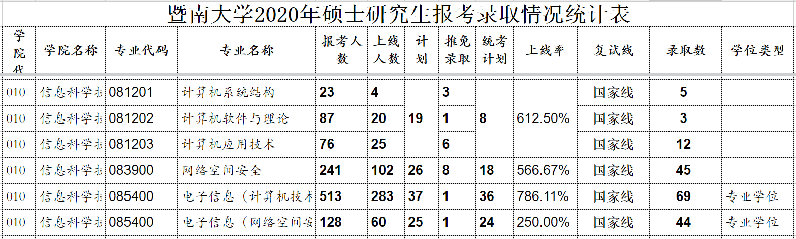
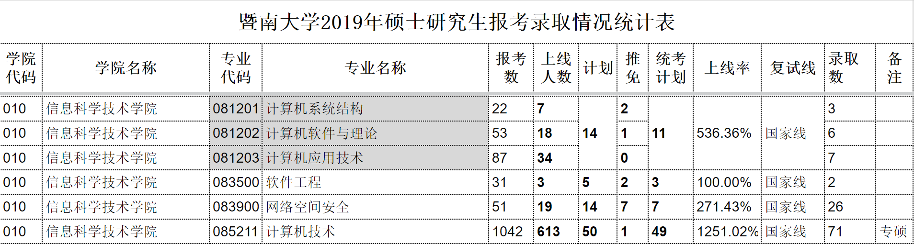

# 暨南大学计算机考研信息汇总

> author: 0x2a
>
> 使用人群：准备报考**暨南大学计算机相关专业**的考生
>
> 如果本仓库在您报考期间有节省些许时间，希望能给个Star~
>
> 转载请注明来源，谢谢。
>
> **22暨南大学计算机/网安考研群：943823112**

* [暨南大学计算机考研信息汇总](#暨南大学计算机考研信息汇总)
  * [关于暨大](#关于暨大)
    * [暨大介绍](#暨大介绍)
    * [暨大CS相关实力](#暨大cs相关实力)
    * [暨南大学报考情况](#暨南大学报考情况)
    * [研究生奖助政策](#研究生奖助政策)
  * [初试](#初试)
    * [暨南大学研究生信息主要渠道](#暨南大学研究生信息主要渠道)
    * [招生简章及专业目录](#招生简章及专业目录)
    * [报录比信息](#报录比信息)
      * [2021](#2021)
      * [2020](#2020)
      * [2019](#2019)
    * [考试大纲](#考试大纲)
    * [考试试题](#考试试题)
    * [参考书目](#参考书目)
    * [2021级考研经验贴分享](#2021级考研经验贴分享)
  * [复试](#复试)
    * [录取情况](#录取情况)
      * [2021](#2021-1)
    * [复试形式](#复试形式)
    * [笔试题目](#笔试题目)

## 关于暨大

### 暨大介绍

暨南大学是中国第一所由政府创办的华侨学府，国家“211工程”重点综合性大学。“暨南”二字出自《尚书·禹贡》：“东渐于海，西被于流沙，朔南暨，声教讫于四海。”意即面向南洋，将中华文化远播到五洲四海。学校目前是中央统战部、教育部、广东省共建的国家“双一流”建设高校，直属中央统战部管理。

学校师资力量雄厚，结构优化，有专任教师2684人，其中两院院士（含双聘）7人，长江学者（含特聘教授、青年长江）16人，杰青、优青获得者39人，“珠江学者”51人，教授834人，副教授1015人，博士生导师1002人，硕士生导师1913人。

学校在广州、深圳、珠海三地设有五个校区，校本部在广州市石牌。校园占地总面积214.30万平方米，校舍建筑面积170.20万平方米，学生宿舍面积44.61万平方米。学校图书馆藏书382万册。学校设有26所附属医院，其中三甲医院11所。

[具体介绍](https://www.jnu.edu.cn/2561/list.htm)

### 暨大CS相关实力

第四轮学科评估排名中，暨南大学计算机科学与技术等级：**B**

信息科学技术学院：

学院现有教职工227人，其中正高49名，副高87名，158人具有博士学位。其中中国工程院外籍院士1人，俄罗斯两院院士1人，美国工程院院士1人，IEEE Fellow 1人，国家杰青获得者2人，海外领军人才1人、国家优青1人、教育部新世纪人才1人，广东省领军人才3人、“广东特支计划” 3人、广东省杰青获得者4人、广东省珠江学者特聘教授1人，广东省珠江学者讲座教授1人，广东省青年珠江学者2人，广州市领军人才1人。

### 暨南大学报考情况

> 2021年全国硕士研究生招生考试网上报名及网上确认工作已结束，**全国共有27455名考生经网上确认报考暨南大学**，相较于去年增加1170人，报考人数创历史新高。

其中**电子信息**报考人数达1773人，信科院专硕报考人数达1637人。

但与此同时，暨南大学**保护一志愿**，并且不招收校外调剂，只招生校内调剂。如21年的智科院AI电子信息专硕招生、能源电力研究中心电子信息调剂、纳米光子学研究院调剂都只允许第一志愿报考暨南大学的同学申请。~~这就出现了科憨在调剂咨询群怒斥我们考848才考那么点分，自己380+的11408无法申请的场面。~~

同时，暨南大学**信息公开透明**，所有专业目录、参考书目、往年真题都可以在研招网上寻得，复试**公平不歧视本科**，~~除了复试录取信息出的慢~~，是一间值得信赖的好学校。

速来冲暨南大学！

### 研究生奖助政策

| 等级 | 覆盖面 | 国家助学金 | 学业奖学金 | 总金额 |
| ---- | ------ | ---------- | ---------- | ------ |
| 一等 | 10%    | 0.5k/月    | 12k/年     | 18k/年 |
| 二等 | 60%    | 0.5k/月    | 6k/年      | 12k/年 |
| 三等 | 30%    | 0.5k/月    | 2k/年      | 8k/年  |

## 初试

### 暨南大学研究生信息主要渠道

- [研招网](https://yz.chsi.com.cn/)
- [暨南大学研究生招生信息网](https://yz.jnu.edu.cn/)
- [暨南大学信科院官网](https://xxxy2016.jnu.edu.cn/)
- [暨南大学智科院官网](https://sisse.jnu.edu.cn/)

### 招生简章及专业目录

- [2021年暨南大学硕士研究生招生简章](https://yz.jnu.edu.cn/2020/0919/c702a515659/page.htm)
- [2021年暨南大学硕士研究生招生专业目录](https://yz.jnu.edu.cn/2020/0720/c6983a500403/page.psp)
- [2020年暨南大学硕士研究生招生简章](https://yz.jnu.edu.cn/2019/0919/c702a418079/page.htm)
- [2020年暨南大学硕士研究生招生专业目录](https://yz.jnu.edu.cn/8e/8f/c6983a364175/page.psp)

### 报录比信息

表格信息中复试线仅代表复试资格线，具体进入复试分数由院系决定。

#### 2021

暂未公布

#### 2020

#### 2019

### 考试大纲

目前2022大纲尚未公布，根据**2021大纲**编写。

1. 计算机学硕（计学）
   - 统考科目：数学一+英语一+思想政治
   - 自命题科目：848（数据结构+操作系统）
   - 校区：石牌校区
2. 网络安全学硕（网学）
   - 统考科目：数学一+英语一+思想政治
   - 自命题科目：830（数据结构）
   - 校区：番禺校区
3. 计算机专硕（计专）
   - 统考科目：数学二+英语二+思想政治
   - 自命题科目：848（数据结构+操作系统）
   - 校区：石牌校区
4. 网络安全专硕（网专）
   - 统考科目：数学二+英语二+思想政治
   - 自命题科目：830（数据结构）
   - 校区：番禺校区
5. 人工智能（智科院）
   - （2022第一年招收统招生，具体科目未定）
   - 校区：珠海校区

自命题大纲如下：

- [830考试大纲](https://github.com/Steve0x2a/JNU_CS/blob/main/info/830%E3%80%8A%E6%95%B0%E6%8D%AE%E7%BB%93%E6%9E%84%E3%80%8B%E8%80%83%E8%AF%95%E5%A4%A7%E7%BA%B2.pdf)
- [848考试大纲](https://github.com/Steve0x2a/JNU_CS/blob/main/info/848%E3%80%8A%E8%AE%A1%E7%AE%97%E6%9C%BA%E5%9F%BA%E7%A1%80%E7%BB%BC%E5%90%88%E3%80%8B%E8%80%83%E8%AF%95%E5%A4%A7%E7%BA%B2.pdf)

### 考试试题

- [830真题](https://github.com/Steve0x2a/JNU_CS/tree/main/ppq/830)
- [848真题](https://github.com/Steve0x2a/JNU_CS/tree/main/ppq/848)

### 参考书目

1. [(目录)数据结构(C语言版).严蔚敏](https://1drv.ms/b/s!AtdN2yuHNMLxhootWw-B9fW_f5coYg?e=gfiLts)
2. [(目录)计算机操作系统（第4版）汤小丹](https://1drv.ms/b/s!AtdN2yuHNMLxhf9aJIM2f0Vb9jdHiA?e=xTp210)
3. [《计算机操作系统（第4版）》学习指导与题解](https://1drv.ms/b/s!AtdN2yuHNMLxhohT040qF9MOeX8PGA?e=fM4dF7)

### 2021级考研经验贴分享

[二本考研初试垫底逆袭暨南大学网专经验贴](https://zhuanlan.zhihu.com/p/362109729)

[2021暨南大学计算机考研经验（跨考）](https://zhuanlan.zhihu.com/p/361866277)

[暨南大学2021计专曲线救国智科AI上岸(经验贴)](https://zhuanlan.zhihu.com/p/362095967)

[二本零基础备战逆袭暨南大学2021网专曲线救国能源上岸（经验贴）](https://zhuanlan.zhihu.com/p/362028306)

[三个月带你上岸暨南大学AI专硕2021](https://zhuanlan.zhihu.com/p/362070927?utm_source=QQ_article_bottom)

## 复试

### 录取情况

#### 2021

1. 计学
   - 复试线：314
   - 录取平均分 336.8
2. 网学
   - 复试线：312
   - 录取平均分：354.5

3. 计专
   - 复试线：361
   - 录取平均分：387.7
4. 网专
   - 复试线：358
   - 录取平均分：390.0
5. 人工智能(智科校内调剂)
   - 复试线: 354
   - 录取平均分: 360

2021复录比情况：信科院除了计专1.8：1，其余都是1.9：1（往年都是1.5：1为主），智科院调剂3：1，能源调剂1.76：1，纳米调剂1.2：1。

[复试名单](https://github.com/Steve0x2a/JNU_CS/blob/main/info/%E6%9A%A8%E5%8D%97%E5%A4%A7%E5%AD%A62021%E5%B9%B4%E5%86%85%E6%8B%9B%E7%A1%95%E5%A3%AB%E7%A0%94%E7%A9%B6%E7%94%9F%E5%A4%8D%E8%AF%95%E6%96%B9%E6%A1%88.doc)

[录取名单](https://github.com/Steve0x2a/JNU_CS/blob/main/info/%E6%9A%A8%E5%8D%97%E5%A4%A7%E5%AD%A62021%E4%BF%A1%E7%A7%91%E9%99%A2%E6%8B%9F%E5%BD%95%E5%8F%96%E5%90%8D%E5%8D%95.xls)

### 复试形式

往年线下复试采用100分笔试+100分面试，初试复试比例5：5。

疫情原因20、21届纯面试，初试复试比例6：4。

### 笔试题目

计算机类笔试为**C/C++**上机，机器环境：大部分机器都是用Dev C++，少部分是VC和c-free5.0。网络安全可选考上机或C

[往年机试真题](https://github.com/Steve0x2a/JNU_CS/tree/main/ppq/code)

